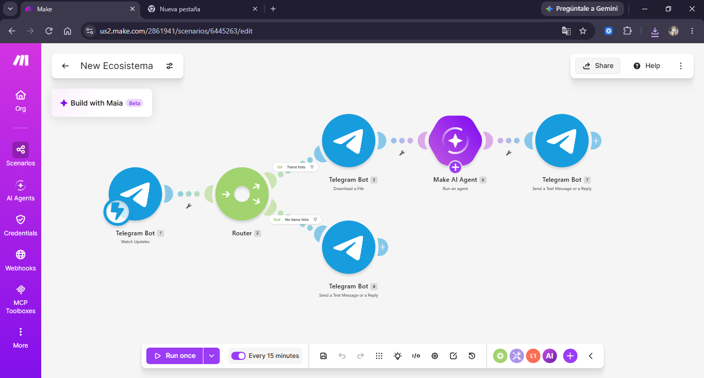
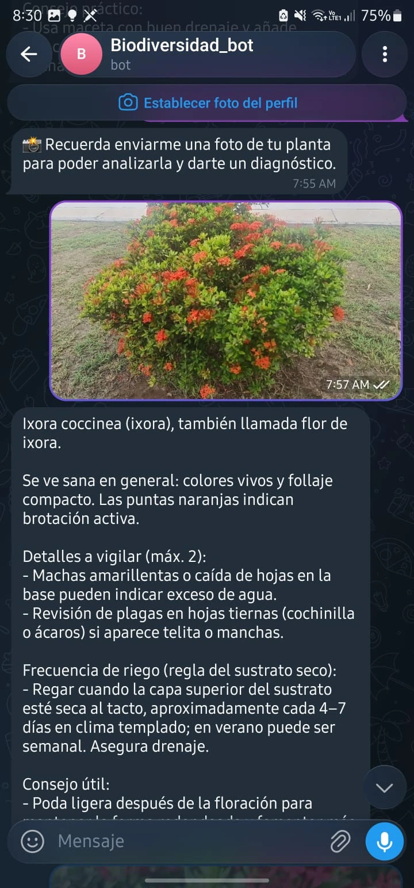
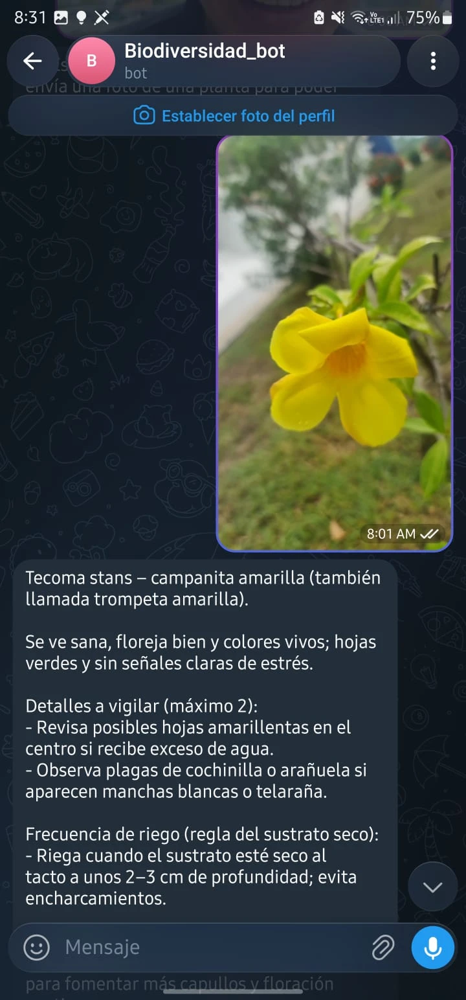
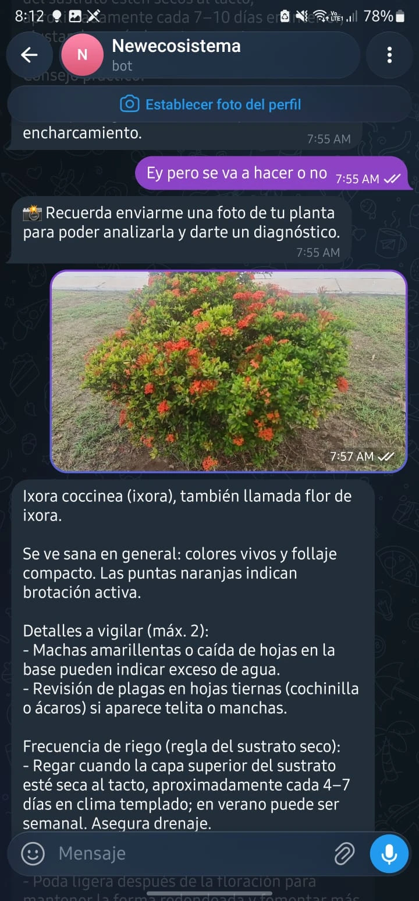

# Nuevo Ecosistema — Bot de Telegram que identifica plantas con IA

**Materia:** Desarrollo Sustentable · **Tema:** Biodiversidad
**Autor:** Roberto Carlos Robles Campos

## 1. Descripción

Automatización construida en Make.com que permite tomar una foto de una
planta y enviarla a un bot de Telegram (`@Newecosistema`) para recibir, en
segundos, un diagnóstico completo: nombre común y científico, si se ve
sana, detalles a vigilar, frecuencia de riego y un tip de cuidado.

Es una evolución del proyecto **"Ecosistema"** (identificación general de
organismos del jardín): aquí el prompt del agente se especializó en un solo
dominio —plantas— para dar respuestas más útiles y accionables.

## 2. Objetivos

- Recibir mensajes de Telegram en tiempo real mediante un webhook.
- Separar el flujo según el tipo de mensaje usando un **Router con filtros**.
- Descargar la foto enviada y analizarla con un **agente de IA** especializado en botánica.
- Validar, tanto en el Router como dentro del propio prompt, que la imagen corresponda a una planta.
- Responder automáticamente con un diagnóstico práctico (salud, riego, cuidado).

## 3. Arquitectura del escenario



```
Telegram: Watch Updates
        │
     Router
   ┌────┴──────────────────────────┐
   │ Filtro "Tiene foto"           │ Filtro "No tiene foto"
   │ (message.photo existe)        │ (message existe y photo no)
   ▼                               ▼
Telegram: Download a File     Telegram: Send a Reply
   ▼                          ("Recuerda enviarme una foto...")
AI Agent: Run an agent
   ▼
Telegram: Send a Reply
```

| # | Módulo | Función |
|---|---|---|
| 1 | Telegram Bot — Watch Updates | Disparador: recibe cada mensaje enviado al bot |
| 2 | Router | Divide el flujo en dos rutas |
| 3 | Telegram Bot — Download a File | Descarga la foto de la planta |
| 6 | Make AI Agent — Run an agent | Identifica la planta y da el diagnóstico |
| 7 | Telegram Bot — Send a Reply | Envía al usuario la respuesta del agente (`6.response`) |
| 4 | Telegram Bot — Send a Reply | Ruta alterna: pide al usuario que envíe una foto |

### Filtros del Router

| Ruta | Nombre del filtro | Condición |
|---|---|---|
| 1 (análisis) | Tiene foto | `{{1.message.photo}}` **Exists** |
| 2 (aviso) | No tiene foto | `{{1.message}}` **Exists** y `{{1.message.photo}}` **Does not exist** |

## 4. Prompt del agente de IA

El agente actúa como un botánico amigable. Primero valida que la imagen
muestre una planta; si no lo es, responde con un mensaje de error fijo.
Si sí lo es, responde en un tono conversacional (máximo 200 palabras) con:

- nombre común y científico,
- si se ve sana o no,
- hasta 2 detalles a vigilar,
- frecuencia de riego (regla del sustrato seco),
- un tip de cuidado.

El texto que recibe el agente usa la función `ifempty()` para tomar el
mensaje (caption) que el usuario escribió junto a la foto, o una pregunta
por defecto si no escribió nada.

## 5. Prueba del bot en Telegram

Identificación de una campanita amarilla (*Tecoma stans*):



Identificación de una Ixora (*Ixora coccinea*):



Segunda prueba con otra foto de Ixora, y respuesta del filtro cuando se
envía texto sin foto:



## 6. Cómo reproducirlo

1. Crear un bot con **@BotFather** en Telegram y guardar el token.
2. En Make, importar [`codigo/blueprint.json`](codigo/blueprint.json)
   (Scenario → `...` → *Import Blueprint*).
3. Crear la conexión de **Telegram Bot** con tu token y asignarla a los
   módulos de Telegram.
4. Asignar tu proveedor de IA en el módulo *Run an agent*.
5. Activar el escenario (**ON**) y enviarle una foto de una planta al bot.

## 7. Video de la prueba en vivo

[Ver la prueba en YouTube](https://youtu.be/gfhIr9WsD9o)

Enlace también en [`video/enlace.txt`](video/enlace.txt).

## 8. Preguntas de reflexión

**¿Qué cambió respecto al escenario "Ecosistema" original?**
El prompt del agente se enfocó en un solo tipo de organismo (plantas) en
vez de cualquier ser vivo, y ahora da un diagnóstico práctico (salud,
riego, cuidado) en lugar de solo clasificar su rol trófico.

**¿Por qué validar el tipo de imagen en dos lugares (Router y prompt)?**
El filtro del Router solo verifica que exista una foto adjunta, no que su
contenido sea una planta. La validación dentro del prompt es la que
realmente revisa el contenido de la imagen y evita dar un diagnóstico
botánico sobre algo que no es una planta.

**¿Qué ventaja tiene usar `ifempty()` con el caption del mensaje?**
Permite que el usuario personalice su pregunta (por ejemplo, "¿por qué
tiene hojas amarillas?") sin romper el flujo si no escribe nada, ya que en
ese caso se usa una pregunta genérica por defecto.

**¿Cómo se relaciona con el desarrollo sustentable?**
Facilita el cuidado responsable de la vegetación urbana y doméstica: un
riego adecuado y la detección temprana de problemas de salud en las
plantas contribuyen a un uso más eficiente del agua y a espacios verdes
más sanos.

## 9. Estructura del repositorio

```
├── README.md
├── codigo/
│   └── blueprint.json
├── imagenes/
│   ├── escenario_completo.png
│   ├── prueba_bot_1.webp
│   ├── prueba_bot_2.webp
│   └── prueba_bot_3.webp
├── video/
│   ├── enlace.txt
│   └── README.md         enlace clicable a la prueba en vivo
└── resultados/
    └── Resultados.pdf    lo aprendido en esta práctica
```
